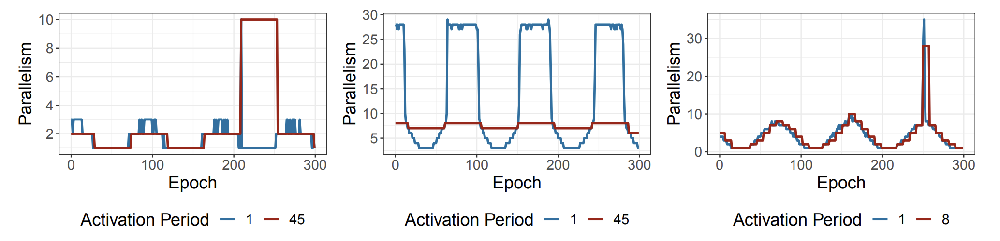

# On Improving Streaming System Autoscaler Behaviour using Windowing and Weighting Methods

<p align="center">
    
    
</p>


## Abstract

Distributed stream processing systems experience highly variable workloads. This presents a challenge when provisioning compute to meet the needs of these workloads. Rightsizing systems for peak demand leads to often-unacceptable financial cost, motivating the need for adaptive approaches to meet the needs of changing workloads. The choice of parallelism of workload operators are commonly governed by autoscalers, but their behaviour is often case specific and highly sensitive to the choice of tunable parameters and thresholds. This presents a challenge to practitioners wishing to understand the performance implications of their decisions. 
    
We systematically explore the impact of parameter tuning for a state-of-the-art autoscaler; identifying impacts in terms of SASO properties as well as behavioural phenomena such as extreme parallelism shifts and robustness. Autoscalers commonly make decisions on instantaneous system performance, without incorporating historical information. This seeks to mitigate challenges of being overly influenced by historical values, to be able to respond in response to the evolving system state. We demonstrate the potential to augment existing state-of-the-art autoscaling controllers with windowing and weighting methods to make more robust decisions, successfully mitigating over 90% of undesirable extreme parallelism shifts and significantly reducing scaling behaviour volatility.

## Contributors

- Stuart Jamieson (Newcastle University, United Kingdom)
- Matthew Forshaw (Newcastle University, United Kingdom and The Alan Turing Institute, United Kingdom)

## Cite Us

This work appears in the Proceedings of the 17th ACM International Conference on Distributed and Event-Based Systems ([DEBS](https://dl.acm.org/conference/debs)). Please cite the following bibkey:

```bibtex
@inproceedings{JamiesonForshaw_DEBS23_WindowingWeighting, 
    author = {Jamieson, Stuart and Forshaw, Matthew}, 
    title = {On Improving Streaming System Autoscaler Behaviour using Windowing and Weighting Methods}, 
    year = {2023}, 
    publisher = {Association for Computing Machinery}, 
    address = {New York, NY, USA}, 
    booktitle = {Proceedings of the 17th ACM International Conference on Distributed and Event-Based Systems (DEBS)}, 
}
```


## Workloads Generators
Section 4.1 introduces the workload arrival processes used throughout this work. Implementations for each arrival process are available below. This includes implementations of each ```SourceFunction``` class, an implementation of a ```WordCount``` workload leveraging each source function. These source functions are directly compatible with the Wordcount implementation provided as part of DS2. This is available [here](https://github.com/strymon-system/ds2/tree/master/flink-examples/src/main/java/ch/ethz/systems/strymon/ds2/flink/wordcount).

| Process                  | Source Function Implementation                                                    | Workload Implementation                                                 |
| ------------------------ | --------------------------------------------------------------------------------- | ----------------------------------------------------------------------- |
| Poisson Process          | [```PoissonSourceFunction.java```](implementation/SourceFunctions/PoissonSourceFunction.java)                    | [```PoissonWordCount.java```](implementation/WordCountWorkload/PoissonWordCount.java)                    |
| Sine Wave Process        | [```SineWaveSourceFunction.java```](implementation/SourceFunctions/SineWaveSourceFunction.java)                  | [```SineWaveWordCount.java```](implementation/WordCountWorkload/SineWaveWordCount.java)                  |
| Envelope-guided Process  | [```EnvelopeSourceFunction.java```](implementation/SourceFunctions/EnvelopeSourceFunction.java)                  | [```EnvelopeWordCount.java```](implementation/WordCountWorkload/EnvelopeWordCount.java)                  |
| Monotonic Step Function  | [```UniformIncrementSourceFunction.java```](implementation/SourceFunctions/UniformIncrementSourceFunction.java)  | [```UniformIncrementWordCount.java```](implementation/WordCountWorkload/UniformIncrementWordCount.java)  |


## Workload Traces
Underpinning this work are approximately 40,000 workload traces.
- The full dataset of these traces is available [here](data/full_traces.csv.zip) (1.5MB, extracting to 234.1MB).
- Furthermore, the workloads which were identified as realising an extreme paralellism shift are available [here](data/workloads_extreme_parallelism_shift.txt).


## Categories of Autoscaler Failure
We present here the experimental configurations to reproduce the illustrative examples of autoscaler failure behaviour.



- **Lack of Reactivity Failure (Left)**:
    - ```Envelope Process - "Source: Custom Source",16#"Splitter FlatMap",10#"Count -> Latency Sink",10 "--amplitude 10000" "--frequency 0.006978" "--step-size 1" "--phase-shift 0" "--vertical-shift 10000" "--sentence-size 100"```
    - Ground Truth (blue line): DS2 with an activation period of 1 produces the base line "ground truth".
    - Failure Case (red line): DS2 with an activation period of 45 produces the "lack of reactivity" failure.

- **Insensitivity Failure (Middle)**
    - ```Sinewave - "Source: Custom Source",15#"Splitter FlatMap",10#"Count -> Latency Sink",10 "--amplitude 12500" "--frequency 0.006978" "--step-size 1" "--phase-shift 0" "--vertical-shift 20000" "--sentence-size 300"```
    - Ground Truth (blue line): DS2 with an activation period of 1 produces the base line "ground truth".
    - Failure Case (red line): DS2 with an activation period of 45 produces the "insensitivity" failure.

- **Extreme Parallelism Shift (Right)**
    - ```Sinewave - "Source: Custom Source",24#"Splitter FlatMap",10#"Count -> Latency Sink",10 "--amplitude 20000" "--frequency 0.006978" "--step-size 1" "--phase-shift 0" "--vertical-shift 20000" "--sentence-size 100"```
    - Ground Truth (blue line): DS2 with an activation period of 1 produces the base line "ground truth".
    - Failure Case (red line): DS2 with an activation period of 8 produces the "extreme parallelism shift" failure.
